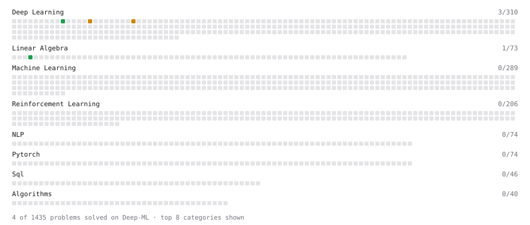

# Deep-ML

My machine learning practice from [Deep-ML](https://www.deep-ml.com). Every solution here was written by hand.

**4** solved · 3 problems · 1 labs · 0 math

[**Browse the interactive portfolio**](https://AYMENsl25.github.io/deep-ml/) to replay this filling in over time.

## Problems

| | Difficulty | Solved | |
| --- | --- | --- | --- |
| [Calculate Mean by Row or Column](https://www.deep-ml.com/problems/4) | easy | 2026-09-18 | [solution](problems/0004-calculate-mean-by-row-or-column) |
| [Leaky ReLU Activation Function](https://www.deep-ml.com/problems/44) | easy | 2026-09-16 | [solution](problems/0044-leaky-relu-activation-function) |
| [Implement PReLU Forward and Backward Pass](https://www.deep-ml.com/problems/98) | medium | 2026-09-16 | [solution](problems/0098-implement-prelu-forward-and-backward-pass) |

## Labs

| | Difficulty | Solved | |
| --- | --- | --- | --- |
| [PyTorch: Build a Complete Training Loop](https://www.deep-ml.com/labs/17) | easy | 2026-09-16 | [solution](labs/0017-pytorch-build-a-complete-training-loop) |

---

_This file is regenerated by Deep-ML on every push._
